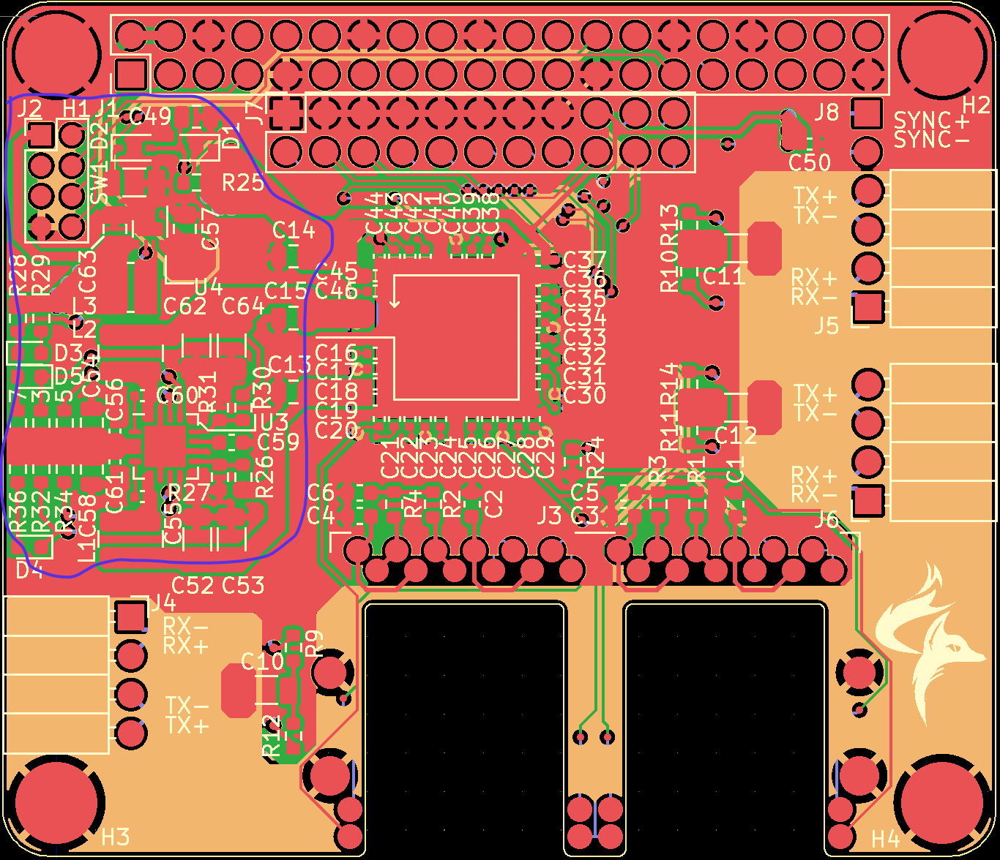

# Ethernet switch design notes

## Components
Core of the board is [Microchip's KSZ8567S](https://ww1.microchip.com/downloads/aemDocuments/documents/OTH/ProductDocuments/DataSheets/KSZ8567S-Data-Sheet-DS00002391C.pdf).

## Fabrication

### Manufacturer options

Clearance properties (minima, units mils):

|  Name   | Min width/space | Min hole | Min hole+pad | Edge keepout |
|:------- |:---------------:|:--------:|:------------:|:------------:|
|Sierra	| 4               | 5.9      | 7.9          | 10           |
|allpcb   | 4               | 7.874    | 13.874       | ?            |
|Sunstone | 4               | 8        | 13           | ?            |
|JLCPCB   | 3.5             | 7.874    | 12.984       | 7.874        |

### Stackup and controlled impedance overview
Sierra circuits can do "any" stackup and impedance that meet their manufacturability constraints. So can design custom stackup and base differential trace properties around it. Their FR4370 prepreg/core material is least expensive. Key links:

- [Stackup designer](https://www.protoexpress.com/tools/pcb-stackup-designer/)
- [Differential impedance calculator](https://impedance.app.protoexpress.com/?data=RqmEU9IhXXnPqy7t60v2+1bfR7giBaGsEUPhFJQFPqANPAyGvsmJbhiJrM1YKOjdAFEOKb0XnaXAZ5ZF4PoHgfDydWjw4l0RQA+Zd6ldz0YznrjY/9gaQAl/Vth8mAJA9RZgitWLofBiWcXapYodcW58EBBREWo1LF9Y05TFQMHqSMA6ERF66cDIo9m01Mi8x+7MjACICOyBcfmtKt+dfB/wWCrACFkra+wycnii1BA5IyFEV/RXE2VYt0Uefxo02OEVMWHDP5XWn5nwUhDYcXvjsiVfgAIQd/KJD6L4XsPjcjmE0kJza3lkt8dwBLZ4ctmbXUfhhiT+TRBy125XJw%3D%3D&q=Fri%20Oct%2014%2014:02:58%20PDT%202022)

So, plan to **design to JLCPCB stackup** and hope Sierra can build it. Then the board design is valid for two manufacturers. Otherwise, would have to customize differential trace width/space for each fab house.

#### Stackup design

##### JLCPCB capabilities:

JLCPCB's JLC7628 prepreg in a 1.6mm thick 4-layer board:

| Layer Name (KiCAD) | Description     | Material | Thickness (mm) | Dielectric constant | Loss Tangent |
|:-------------------|:----------------|:---------|:--------------:|:-------------------:|:------------:|
| F.Mask             | **Top mask**    | ?        | 0.02/0.0127    | 3.8                 | ?            |
| F.Cu               | **Top Cu**      | Copper   | 0.035          | ?                   | ?            |
| Dielectric 1       | **Prepreg**     | JLC7628  | 0.18034        | 4.6                 | ?            |
| In1.Cu             | **Inner Cu 1**  | Copper   | 0.0152         | ?                   | ?            |
| Dielectric 2       | **Core**        | Copper   | 1.065          | 4.6                 | ?            |
| In2.Cu             | **Inner Cu 2**  | Copper   | 0.0152         | ?                   | ?            |
| Dielectric 3       | **Prepreg**     | JLC7628  | 0.18034        | 4.6                 | ?            |
| B.Cu               | **Bottom Cu**   | Copper   | 0.035          | ?                   | ?            |
| B.Mask             | **Bottom mask** | ?        | 0.02/0.0127    | 3.8                 | ?            |

JLCPCB's JLC3313 prepreg in a 1.6mm thick 4-layer board:

| Layer Name (KiCAD) | Description     | Material | Thickness (mm) | Dielectric constant | Loss Tangent |
|:-------------------|:----------------|:---------|:--------------:|:-------------------:|:------------:|
| F.Mask             | **Top mask**    | ?        | 0.02/0.0127    | 3.8                 | ?            |
| F.Cu               | **Top Cu**      | Copper   | 0.035          | ?                   | ?            |
| Dielectric 1       | **Prepreg**     | JLC3313  | 0.0889         | 4.05                | ?            |
| In1.Cu             | **Inner Cu 1**  | Copper   | 0.0152         | ?                   | ?            |
| Dielectric 2       | **Core**        | Copper   | 1.265          | 4.6                 | ?            |
| In2.Cu             | **Inner Cu 2**  | Copper   | 0.0152         | ?                   | ?            |
| Dielectric 3       | **Prepreg**     | JLC3313  | 0.0889         | 4.05                | ?            |
| B.Cu               | **Bottom Cu**   | Copper   | 0.035          | ?                   | ?            |
| B.Mask             | **Bottom mask** | ?        | 0.02/0.0127    | 3.8                 | ?            |

In the above two tables, soldermask thicknesses are written *over substrate*/*over trace*. Impedance calculations considering soldermask thickness should use the second number, *over trace*. Also, prepreg thicknesses assume controlled impedance traces will be routed on top and bottom layers, not inner layers. Data is copied from [JLCPCB's site here](https://cart.jlcpcb.com/impedance).

A board built to the JLC7628 table, with 5 mil wide traces spaced 4 mil apart, has 99.74 Ω differential impedance.

A board built to the JLC3313 table, with 4 mil wide traces spaced 5 mil apart, has 99.96 Ω differential impedance.

##### Sierra Circuits' capabilities

Using Sierra's stackup calculator trial, I get this stack: 

| Layer Name (KiCAD) | Description     | Material | Thickness (mm) | Dielectric constant | Loss Tangent |
|:-------------------|:----------------|:---------|:--------------:|:-------------------:|:------------:|
| F.Mask             | **Top mask**    | ?        | 0.0127         | 4.2                 | ?            |
| F.Cu               | **Top Cu**      | Copper   | 0.0368         | ?                   | ?            |
| Dielectric 1       | **Prepreg**     | FR370HR  | 0.109          | 3.54                | ?            |
| In1.Cu             | **Inner Cu 1**  | Copper   | 0.0356         | ?                   | ?            |
| Dielectric 2       | **Core**        | FR370HR  | 1.1938         | 4.24                | ?            |
| In2.Cu             | **Inner Cu 2**  | Copper   | 0.0356         | ?                   | ?            |
| Dielectric 3       | **Prepreg**     | FR370HR  | 0.109          | 3.54                | ?            |
| B.Cu               | **Bottom Cu**   | Copper   | 0.0368         | ?                   | ?            |
| B.Mask             | **Bottom mask** | ?        | 0.0127         | 4.2                 | ?            |

A board built to this table, with 4.45 mil wide traces spaced 5 mil apart, has 100.35 Ω differential impedance. A "Level 1" board with this stackup supports: 

- minimum via drill 8 mil
- minimum annular ring 3 mil
- minimum inner trace width 4 mil
- minimum outer trace width 5 mil

Note that this stackup has 0.25 oz copper for outer layers and 1 oz copper for inner layers. This is opposite the JLCPCB (and other fab) standard of thicker outer layers/thinner inner. Also has an FR4 core instead of the JLCPCB copper core.

##### Comparison/planning:


Here is a summary of output from JLCPCB's and Sierra's online impedance calculators. The point at 6 mil width on the JLC3313 curve is a guess, so it should not be trusted. So, there is not much information on the JLC3313 curve to define it. 

Instead, compare JLC7628 to FR370HR. These look like they converge for small trace widths, and plugging in 5 mil width/4 mil space (JLCPCB's calculator minimum) into Sierra's tool yields ~104 Ω differential impedance. This is good enough.

**So, use 5 mil trace width and 4 mil space.** This will deliver 99.74 Ω differential impedance with JLC7628 stackup and 103.94 Ω differential impedance with the Sierra FR370HR stackup in the table above. 

**Oshpark** would need 11 width/5 space.

## Assembly order
1. U3 and U4 reflow
2. Other power components with iron (inductors, big caps last)
3. Test power supply
4. U1 and Y1 reflow in one heating
5. TR1-TR6 and FL1-FL6 reflow
6. All remaining SMD parts with iron
7. J3 with iron
8. J7 with iron


*parts to do for steps 1-2*

### Shorts
1. `+1V2` <=> `GND`
2. `+2V5` <=> `GND`
	
	(suspect `GND` pad on `U3` is problem)
	(OR could easily be a bridge somewhere on `U1`)
3. short across `C51`, `XO` <=> `GND`	
4. possible bridge on north side of `U1`---checked on microscope; remove with iron and re-check.

If 4. doesn't pan out, try reflowing `U3`

IT'S THE LITTLE DAMN CIRCLE. PIN 1 IS THE LITTLE CIRCLE, NOT THE BIG ONE.

### Work Dec 6 2022
1. Desoldered `U1` (apparently pin 1 was 180º away).
2. Tested power supplies:
	- 3V3. looks good---read 3.36V on scope.
	- 1V2. looks good---read 1.22V on scope.
	- 2V5. looks good---read 2.56V on scope.
	- All have tiny, tiny ripple. Keep in mind this was unloaded.
3. Resolder `U1`.
4. Tested power again, all voltages look good. Draws total 104mA on 5V in
5. Cleaned up some flux, but hard to get all of it.
6. Things look good under the microscope. No obvious shorts (except one GND<=>GND between pins 46 and 47.
7. Retest power after cleaning on better scope:
	- 3V3. looks good---read 3.36V, 16mV P-P
	- 2V5. looks good---read 2.56V, 27mV P-P
	- 1V2. looks good---read 1.21V, 16mV P-P
	- Total draw on 5V: 1.4A (consistent). `U1` warms slightly to touch.
	
8. laptop to Pi direct connect
	- From Pi, `AthanasisosPantazides.local` resolves to `169.254.42.77`
	- From laptop, `raspberrypi.local` resolves to `169.254.48.24`
9. laptop to switch, Pi to switch (CAT5s)
	- Switch now draws 170mA from 5V supply.
	- **IT WORKS**
		- Can ssh from laptop to Pi via switch.
		- Can `ping` laptop from Pi and vice-versa. Get these summary stats from ping:

laptop side:

```
round-trip min/avg/max/stddev = 0.656/1.026/1.683/0.180 ms
``` 

Pi side:

```
rtt min/avg/max/mdev = 0.614/1.028/1.425/0.193 ms
```

laptop side with 90º jumper (not short CAT5):
```
round-trip min/avg/max/stddev = 0.865/1.219/2.156/0.279 ms
```

10. test stack assembly:
	- switch has tons of clearance to Pi (using ESQ-120-24-G-D stack header on switch + 5/8" length standoff)
	- ~~switch **conflicts** with capacitor on bottom of SPMU-001 (using 7/16" length standoff between switch and SPMU-001)~~
		- ~~unclear yet if SPMU-001 header (SSQ-120-01-G-D) will need to change to maintain sufficient electrical contact with switch's header once taller standoffs used.~~
		- ~~capacitor is 1.8 mm tall off bottom of board (measured).~~
		- ~~dual RJ45 is 9.9 mm tall off board~~
	- **OOOOPS:** using wrong standoffs. With correct standoffs plenty of clearance.

### Management/housekeeping
**Use in-band access**

- Enable with IBA jumper
- See PDF page 63.
- Need to use SPI/I2C to switch IBA port from 7 to (one of the PHY ones, [1-5])


## Version 2 desired changelog
1. Fix LEDs