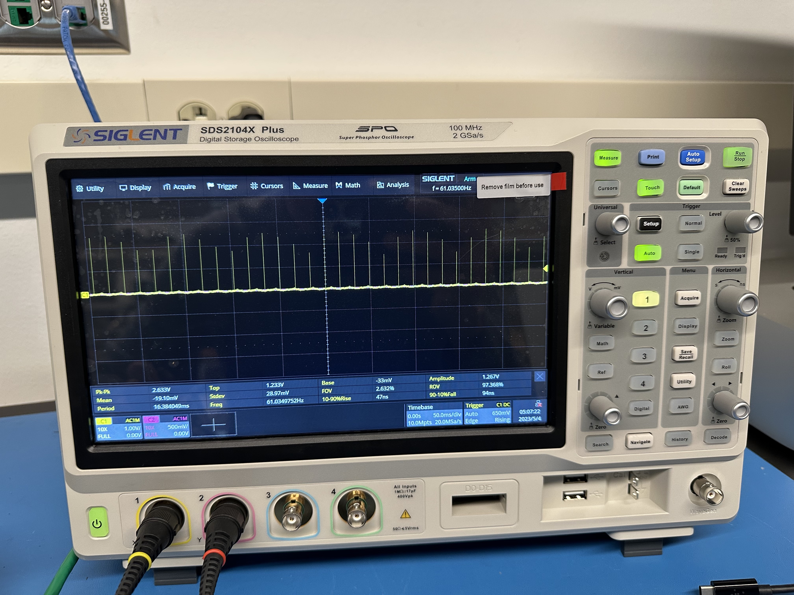
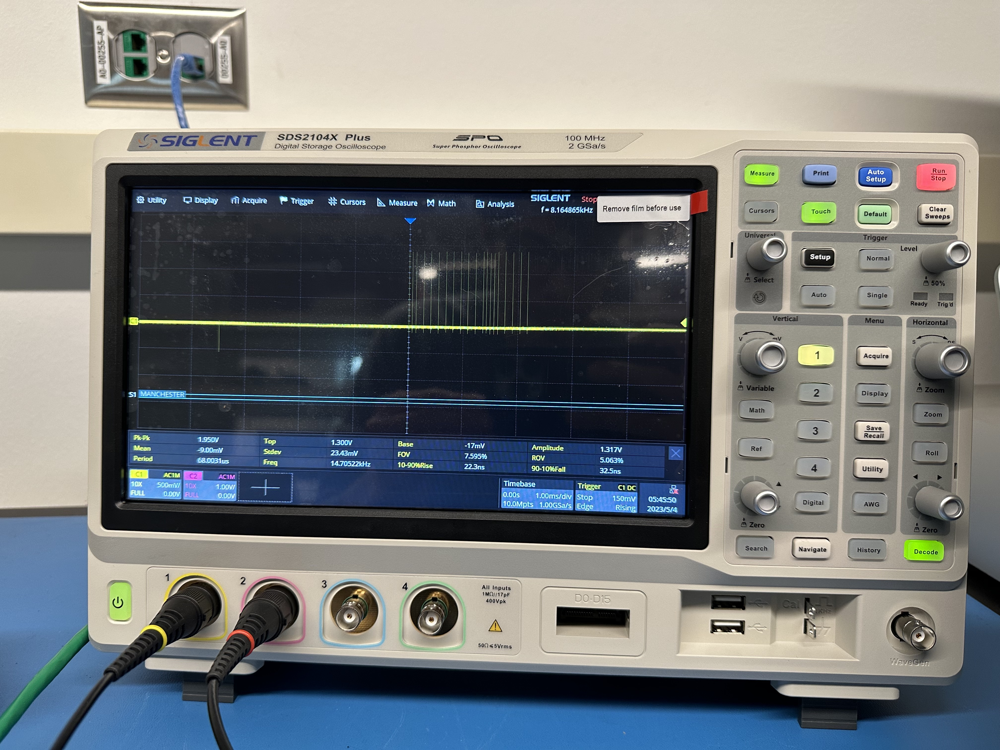
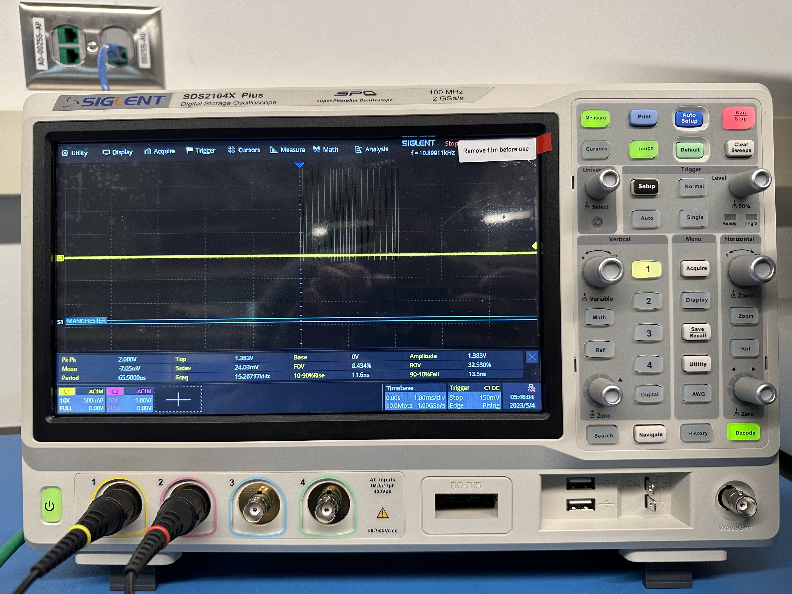
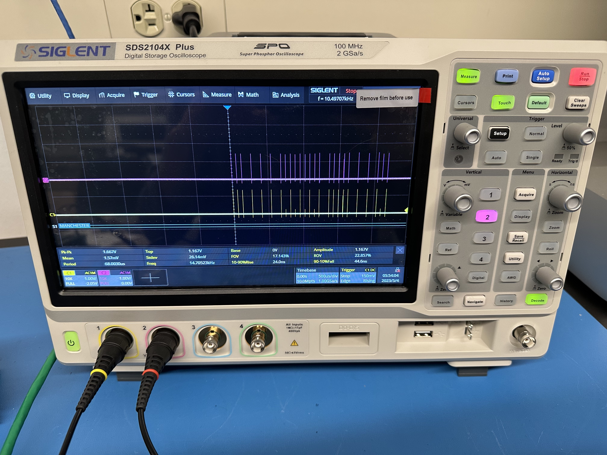
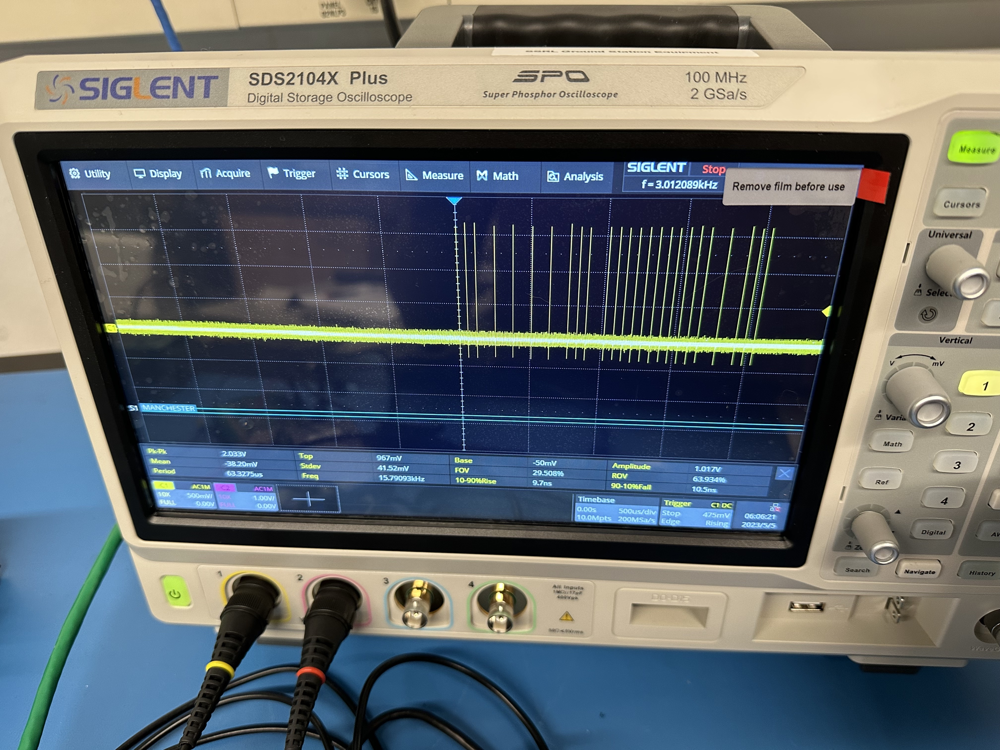

# Plenum board design notes

## Components

### [PCI18F66J60](http://ww1.microchip.com/downloads/en/DeviceDoc/39762f.pdf) microcontroller
Microcontroller with I/Os: SPI, I2C, Ethernet, GPIO. *Would be good to write clean SPI driver, since many peripherals use SPI*.

#### Programming
Use the [PICkit 4 In-Circuit Debugger](https://ww1.microchip.com/downloads/en/DeviceDoc/50002751F.pdf). Has 8-pin connector to board (supply programmer with USB to laptop power, or power board separately). Connector is 0.1" sockets with pinout:


| Pin	| Description	|
|:-------|:------------|
| 1		| `nMCLR`		|
| 2		| `VDD`		|
| 3		| `GND` 		|
| 4		| `PGD`		|
| 5		| `PGC`		|
| 6 		| DNC		|
| 7		| Unused		|
| 8		| Unused		|

It would be nice to run this pinout verbatim down one side of the 2x8 power-to-plenum interboard stacking connector. 

The `PGC` and `PGD` pins are supposed to be kept as short as possible (datasheet p.46). 

Key interfaces: 

### SPI

### Ethernet

### GPIOs to reserve for debug

- UART interface
- An interrupt (INT3)
- Some analog inputs

### Sensing

#### [LTC2983](https://www.analog.com/media/en/technical-documentation/data-sheets/2983fc.pdf) temperature sensor readout
Use with RTDs (9 3-wire RTDs per chip possible, if sharing compensation pin). Total of 18 sensors read out by 2 copies of chip. 

Interface with µC using SPI: `nCS` (for refdes `U19`) and `nCS2` (for refdes `US20`).


#### RTDs

Using **TE NB-PTCO-002**, Digikey 223-1773-ND. Inexpensive, 2-sip package, Pt100. Well-documented.

#### [BMI270](https://www.bosch-sensortec.com/media/boschsensortec/downloads/datasheets/bst-bmi270-ds000.pdf) IMU
Not strictly necessary, but may complement NSROC GNC data.

* Use 3V3 for input voltage. Max typical current draw is 970 µA @ VDD=1V8, in accelerometer and gyro performance mode, in ambient 25 ºC. This is 1.746 mW, or 0.529 µA equivalent current at 3V3 input.
* Wish to use in SPI mode, but I2C is default interface. To enable SPI, the CS pin needs to see a rising edge (start low, go high) after the BMI270 powers up. This must be done after every powerup or reset to enable SPI communication. Otherwise, can set the `spi_en` bit in the register `NV_CONF` to permanently set SPI as the data interface.
* Has internal temperature sensor, updates when gyro enabled.

#### Hygrometry
From [Digikey](https://www.digikey.com/en/products/filter/humidity-moisture-sensors/529?s=N4IgjCBcoCwdIDGUBmBDANgZwKYBoQB7KAbRAGYBOSgBgFYAOEAmGgNjHeYrHIfIBMIALoEADgBcoIAMoSATgEsAdgHMQAXwJtKUUMkjps+IqRCtKVctzhgGlAOwjxUyLIUr1WkALpCEBka4BMSQZHZgdHQQBAJgAhxOsfFs9NxxvuQ06fF0DjE+uQx0Ob40ST7Flrqx5KmUbKUwvk3kME0wFRkwbI3JAp0l-Z1Mw47OIJLSckpqmgRtJQGomMGmYRR0vVvc5Fu9fZsHTKKTru6zXgRglPZ6SCvGIWbZwt4CAlT3gasmoeE0AAEWG4DGB3Ac4O0UJAdBhMBh5BhNAAdGBETQgQBbEHXGFgFFI3HgFFw4kCcGnKZuACqykUEgA8igALI4NBYACu8hwmg0GiAA), can't find a good panel-/chassis-mount sensor for this that we could stick in the focal plane. May need to do a mini board with the sensor mounted that goes inside the blanketing.

#### Pressure
Consider [MS5607](https://www.te.com/commerce/DocumentDelivery/DDEController?Action=srchrtrv&DocNm=MS5607-02BA03&DocType=Data+Sheet&DocLang=English) or [MS5803](https://www.te.com/commerce/DocumentDelivery/DDEController?Action=srchrtrv&DocNm=MS5803-01BA&DocType=Data+Sheet&DocLang=English) from TE. Both very small, inexpensive, with SPI interface.

#### Integrated gas sensor
Could also take temperature, pressure, humidity, and gas content measurement with [Bosch BME680](https://www.bosch-sensortec.com/media/boschsensortec/downloads/datasheets/bst-bme680-ds001.pdf). But it is extremely tiny, at 9 mm^2 footprint area. 

[Github driver here](https://github.com/BoschSensortec/BME68x-Sensor-API).

#### Current sensing on Phil's board
Consider [AD7490](https://www.analog.com/media/en/technical-documentation/data-sheets/AD7490.pdf) 16:1 ADC to SPI converter. Can monitor 12x current sense resistors on Phil board with GND reference (put current sensing on low side), plus 4x voltages (5 V, 5.5 V, 12 V, 28 V in?). Need to normalize all voltages to 0-5 V range.

### Clock sync
Sequence of events:

1. `LAUNCH` signal (indicating launch about to occur, signal driver NSROC via power board) goes HIGH. 
2. Causes NOR-based SR-latch (refdes `U3` + `U4`) to latch HIGH (output signal `Q`. Nominally, `LAUNCH` remains HIGH until µC sets `UNLAUNCH` HIGH, nominally on receive `SHUTTER` signal HIGH (signal driver NSROC via power board). 
3. On next rising edge of `PPS` (signal driver NSROC via power board), `PPS` AND `LAUNCH`/`Q`, single-ended `SYNC` output of AND gate (refdes `U5`) goes HIGH, driving TTL inputs of differential transmitters (refdes `U6` - `U11`).
4. When µC receives `SHUTTER` HIGH, regardless of `LAUNCH` state, it will set `UNLAUNCH` output low after next observed `SYNC` falling edge. This will latch the SR into `nQ` state HIGH/`Q` state LOW, turning off the AND gate `U5` and choking `SYNC` throughput.

Alternative plan for step 4: µC simply notifies formatter of the time `SHUTTER` goes HIGH and continues sending `SYNC` to subsystems until power is cut. 

Note that µC must notify formatter of `SHUTTER` latch HIGH anyway so formatter can inform subsystems of imminent power off.

### Watchdog timer

See datasheet p. 367. May be handy to implement.

## Routing

- Note: Fusion360 model (as of Mar22 2023) has all connectors on BOTTOM side of board.
- MOVE ALL CONNECTORS TOP SIDE. 
- Keep all reflow ICs top side. 
- Hand-solder components can go wherever.

### SPI

SPI traces are 8 mil wide. Need to route LEFT to header, then up to Phil board. Length to Phil: 2" on plenum + max 4" on Phil -> 6" total. See ~0.6 V drop to Phil. Use SPI buffer chip at header.

To onboard stuff (RTD readouts + Bosch sensors), ~2.5" total length (route SPI serially, not as star, to peripherals to keep stubs short). See ~0.25 V drop to end of these lines. Should be ok.

## Manufacturing

Go with Sierra Circuits for flight boards. Quoted \$650 for impedance and stackup-controlled Ethernet switch. 

[Capabilities](https://summitinterconnect.com//wp-content/uploads/2023/01/Summit-Capabilities-All-Facilities-Combined.pdf).

With stackup sent (from Teresa, Mar 24 2023), 100Ω Zdiff is achieved with **10 mil trace width, 5 mil space** on top layer (reference plane Layer 2).

### Quotes

Include stencil in quote.

#### JLCPCB

Just for reference.

 
##### Board options: 

For min qty:

- aerospace PCB (add ~$20)
- FR4 TG155 (add ~$3)
- ENIG (add ~$15)
- 1 oz / 0.5 oz / 0.5 oz / 1 oz
- min 0.2 mm hole via
- paper between
- some impedance-controlled stackup


Total board: \$90.80

##### Stencil options:

For separate top/bottom stencil:

- basic stencil, $14
- add frame, $8 more
- add step stencil (different depths for different ARs), $37 more
    - and need to specify depths for each component. Maybe not.
- add fiducial etch, no price change

##### Summary:

Total including stencil: \$113.

Stencil cost: \$22.39.

#### Sierra:

Total cost (for 1-5 boards) : \$1090 @ 4 wk lead, \$1113 @ 2 wk lead, \$1147 @ 5 day lead. No option for stencil.

#### Macrofab:

Doesn't support KiCad 7 upload. Call during day.

#### Circuithub:

Doesn't support KiCad 7 upload. Emailed.

#### Advanced Circuits:

No option for stencil.


Total cost for 3 boards, no controlled dielectric: \$500 @ 5 day lead

Total cost for 3 boards, w/ controlled dielectric: \$1107 @ 1 wk lead, \$864 @ 4 wk lead

#### Imagineering:

For qty 3 boards.

##### Taiwan:

No option for stencil.

Total cost for 3 boards, w/o impedance control: \$396

Total cost for 3 boards, w/ impedance control: \$584


##### US:

No option for stencil. 

Total cost for 3 boards, w/ or w/o impedance control: \$1200 @ 4 - 10 day lead

#### Sunstone:

Total cost for 3 boards, w/o impedance control (stackup is known): \$1277 @ 3 wk lead, \$1743 @ 1 wk lead

##### Stencil options:

- "prototype stencil" is \$270 for a pair, top and bottom side. Cutting fiducials included.
- oversize prototype stencil is \$350
- framed stencils are priced by size. Smallest (8x10 in) is \$390.

#### Euro Circuits:

Total cost for 3 boards: €286 @ 2 wk lead

Total cost for top + bottom stencils: €82

#### Oshpark:

No option for stencil.

Total cost for 3 boards, w/o impedance control (stackup is known): \$108.

Caveat: min hole size is 10 mil, but only need 4 mil annular---can sub out all 8 mil vias on board without clearance issues (unless hole-hole clearance becomes problem).

#### PCB Power market USA:

No option for stencil. 

Total cost for 3 boards, w/o impedance control: \$685 @ 2 wk lead

#### PCB Unlimited

##### US manufacturing

Total cost for 3 boards, w/o impedance control: \$530 @ 2 wk lead

#### Pentalogix

##### US manufacturing

Total cost for 3 boards, w/o impedance control: \$360 @ 5 day lead

Frameless stencil is \$150.

#### Advanced Assembly

**acquired by Summit**

Total cost for 3 boards, w/o impedance control: \$1277 @ 2 wk lead (with ENIG), same but with HASL is \$1215

- Talking to quoting guy (Pat).

#### Bay Area Circuits

Total cost for 3 boards, w/o dielectric control: \$950 @ 10 day lead (with ENIG), same but with HASL is \$500

Total cost for 3 boards, w/o dielectric control: \$873 @ 10 day lead (with HASL)

#### PNC 

Total cost for 3 boards, w/o impedance control: \$1187 @ 15 day lead (with ENIG)

#### OSH Stencils:

Just do stencils. Not Oshpark. Total for top + bottom stainless steel 4 mil thick stencils: \$59.

## Build

### Apr 14

Populated board Apr 14. Initially, 3V3 plane was at 5V. PIC received 5V on inputs ~3 times, for total of ~1 minute. This is outside operating voltage range. When trying to program with PicKit-4, PIC was unreachable (MPLABX received `0x00000000` when trying to read back `0x0000EF13`. Found no issues with PicKit-4 lines to PIC (on scope), and reduced programming speed to Low in MPLABX without any effect.

### Apr 17

Try to remove PIC and swap for (potentially) non-dead version. Before swap in, debug 5V => 3V3 converter.

5V => 3V3 converter works now. Still unable to program PIC. Memory read appears to work (when checking configuration bits in MPLABX), but the values read out are inverted when changing the pull up/down direction of the PicKit-4. So it is just reading a dead line.

### Apr 18

Noticed 2V5 output (VDDCORE) is very noisy, ~400 mV Pk-Pk. So installed 10 µF bypass for VDDCORE on bottom side. Noise is very small now. 

After bypassing VDDCORE, can now program PIC successfully with PicKit-4. 

New issue: crystal clock frequency (`Y1`, clock for PIC) is 8.33 kHz. Swapping crystal does not fix. Note: after swapping crystal, current draw form power supply 5V is now 0.14 A. Used to be 0.04 A. Suspect this is a firmware clock settings, because 8.33 * 300 is 25 MHz?. Try 

```C
pragma config FOSC = HSPLL
```

instead of `ECPLL`.

### Apr 26

#### Getting clock working

Replaced crystal `Y1` with a different 25 MHz crystal to check. No change from 8.33 kHz output, and very slow RA3 blink.

Then, modified `configuration_bits.txt` line 62 to:

```C
pragma config FOSC = HSPLL
```

and modified `main.c`:

```C
#define _XTAL_FREQ 25000000UL
```

and added two lines before main loop starts:

```C
OSCTUNE = 0x00;
OSCCON |= 2;
```

(see [datasheet](https://ww1.microchip.com/downloads/en/DeviceDoc/39762f.pdf) pp 51-4 for full description).

The `OSCTUNE` bits 7:4 set PLL prescalar and postscalar settings (for driving the internal clock from external crystal). Only the MSB 4 bits are used. Setting the first four bits to `x00x` (`x` is don't care) bypasses any PLL, so the 25 MHz clock can be used for driving Ethernet.

The `OSCCON` register has 3 writable bits: 7, 1, and 0. `OSCCON` bit 7 (called `IDLEN`) chooses Idle mode (1) or Sleep mode (0) when the `SLEEP` instruction is issued. Bits 1 and 0 (called `SCS`) selects the primary oscillator. Setting `0b10` chooses the primary oscillator (connected on pins `OSC1` and `OSC2`) as the system clock. So we modify the last two bits of `OSCCON` by OR-ing with `0b10` (a.k.a decimal 2).

#### Trying SPI

Starts on [datasheet](https://ww1.microchip.com/downloads/en/DeviceDoc/39762f.pdf) page 269. 

- SPI will be used in master mode.
- Since this is a 64-pin device, use registers `SSP1STAT`, `SSP1CON1`, and `SSP1CON2` to setup SPI. `SSP1BUF` is receive/transmit buffer.
- `SSP1STAT` is status register for SPI (and I2C). `SSP1CONx` is control register.
- `SSP1STAT`:
    - bit 7: `SMP`: sample bit: 
        - setting 1 samples DIN at end of DOUT time
        - setting 0 samples DIN at middle of DOUT time
    - bit 6: `CKE`: clock select bit: (**figure out what to set**)
        - DOUT transmit occurs on transition from active to idle clock state
        - DOUT transmit occurs on transition from idle to active clock state
    - bits 5-1: I2C only
    - bit 0: buffer full status (read only)
- `SSP1CON1`:
    - bit 7: `WCOL`: write collision detection.
        - read 1: `SSP1BUF` was written while transmitting previous word
        - read 0: no collision
    - bit 6: `SSPOV`: receive overflow indicator
        - has read use for SPI slave mode only. Would write to clear.
    - bit 5: `SSPEN`: enables master SSP port
        - setting 1 enables port and configures `SCK`, `SDO`, `SDI`, `nSS` as serial port pins. **When setting, need to configure as inputs/outputs correctly.**
        - setting 0 enables port and configures those pins as I/Os.
    - bit 4: `CKP`: clock polarity setting
        - setting 1: idle state for clock is `HIGH`
        - setting 0: idle state for clock is `LOW`
    - bit 3-0: `SSPM<3:0>`
        - option `0101` is SPI slave mode, `nSS` pin is I/O
        - option `0100` is SPI slave mode, `nSS` is chip select
        - option `0011` SPI master mode, clock is $\frac{1}{2}$TMR2 output
        - option `0010` SPI master mode, clock is `FOSC`/64 (would be 390.625 kHz w/ 25 MHz sys clock)
            - 390 kHz SPI clock is slow enough for all connected peripherals: MAX7317, AD7490, LTC2983, BME680, BMI270
        - option `0001` SPI master mode, clock is `FOSC`/16
        - option `0000` SPI master mode, clock is `FOSC`/4
        - other options are either reserved or used for I2C only.

In summary: to configure SPI, need to set `SSP1CON<5:0>` and `SSP1STAT<7:6>`.

Can reset SPI interface by setting `SSPI1CON<5>` to 0, modifying SPI settings, then setting `SSPI1CON<5>` to 1 again.

SPI CPOL/CPHA terminology:

|(CPOL, CPHA)     |`CKP`|`CKE`|
|:---------------:|:---:|:---:|
|0,0              | 0   | 1   |
|0,1              | 0   | 0   |
|1,0              | 1   | 1   |
|1,1              | 1   | 0   |

##### Setting up SPI pins
- `SDI` is automatically set by SPI controller
- `SDO` must have `TRISC<5>` bit cleared
- `SCK` in master mode must have `TRISC<3>` bit cleared

### Apr 27

Didn't implement SPI from yesterday.

#### Checking Ethernet
##### LEDs
- set `ETHLED` bit
- and clear bits `TRISA<1:0>` to set LEDs as output
- Modify blink usage in `PHLCON` register, p. 238

##### Ethernet
- `ETHEN` bit in `ECON2<5>` should be set

##### Code changes
Edited `spi2ether` project. Configured and added MAC, TCP/IP Lite, MSSP1, TMR1 modules to project via MCC. Referenced [Microchip AN1921](https://ww1.microchip.com/downloads/en/Appnotes/Microchip-AN1921-8-bit-PICMCU-TCP-IP-LiteStack-ApplicationNote-00001921D.pdf). See p. 16 for server implementation.

### Apr 28
Tried building `spi2ether` project, but no luck connecting. Also tried [Microchip TCP example](https://github.com/microchip-pic-avr-solutions/ethxxj60-tcpip-solution), but no luck either. 

LEDs never light (on either side of link).

Probing across TX± and RX± out of the PIC, found close to 0Ω impedence across differential pair. **Check if this is expected in datasheet**.

Things to try next:
- If diff. pair is shorted, fix short.
- Remove filter components after RJ45, just go straight from RJ45 into PIC.
- Can try a different protocol (UDP)

### May 1
Realized termination resistors (`R8`, `R9`, `R12`, `R13`) should have been placed at PIC, not after jack. So there is a ~1" stub after RJ45 before PIC. To fix, try pulling ferrites and termination from Ethernet lines, and adding termination jumped to PIC chip.

### May 2
Removed TX-side termination resistors `R8` and `R9`. Added short jumpers at PIC Ethernet TX± pins and connected two 49.9Ω series termination resistors across the TX pair. Center of pair is connected to `GND` via 0.1 µF cap (as in schematic for board). Note pullup to 3V3 (from schematic) was **not** implemented.

Also downloaded Microchip's .jar application from AN1921 and changed port number in PIC code to port 7 (used for TCP echo applications).

After modification and using .jar app, still cannot connect. 

Probed out everything with the scope, and found the TX lines from PIC have less clear edges. All TX and RX from PIC and desktop send a pulse a couple times per second (pulse sent both on TX and RX). This can be seen probing the unconnected end of a CAT5 cable which is connected (on the other end) to the GSE machine, and by probing the outputs of the Housekeeping board with no cable connected. Checked many configurations: 
- CAT5 cable connected and unconnected
- Before and after RJ45 magnetics
- Before and after ferrites on TX
- At PIC inputs (by newly installed termination) and at end of trace (by ferrites)

Found same basic pulse shape everywhere, but edges are worse/more ringing at PIC TX output. GSE machine seems to output cleaner pulses. PIC TX output lines have higher amplitude than RX inputs, so should be able to at list catch the rising edge.

### May 3
Switched to Microchip UDP demo, still no luck getting working. The unconnected HK TX+ emits this: 


But unconnected TX+ from laptop or Formatter/ether switch (respectively) emit this:



Also, here are two different output ports of the Formatter/ether switch TX+ line with nothing connected:


Suspect this is the MAC broadcasting its address or something. Seeming more and more like a fundamental problem with the HK board?

### May 4
The signal from the PIC TX+ line appears to be a Normal Link Pulse (NLP), which are typically spaced 16 ms apart. This is a physical-layer signal used in [10BASE-T autonegotiation](https://en.wikipedia.org/wiki/Autonegotiation). The signal on the same line, coming from the GSE machine appears to be a Fast Link Pulse (FLP):



The first three pulses span exactly 125 µs, as in the [wikipedia image](https://en.wikipedia.org/wiki/Autonegotiation#/media/File:Link-code-word.svg) for FLP bursts.

Note that the FLP appears on both the TX± and RX± lines out of the GSE machine Ether. The NLP signal appears only on the TX± lines out of the PIC.

If I plug GSE computer into Formatter ether switch, and Formatter ether switch into HK board, lights on ether switch RJ45 blink (but not on HK board RJ45). This could just be the switch doing it. Also, NLPs appear on HK RX± lines. No overlapped FLP packets visible on HK TX lines (unlike when GSE computer plugged straight into HK board. **Possibly something going on with crossover?**

**Also note:** autonegotiation requires *both* ends of a link to negotiate in order to work. If the PIC-side does not support it (it is never mentioned by name in the datasheet), autonegotiation will fail. Would need to force the other end of the link to use appropriate IEEE standard on setup.

From PIC datasheet:

> The Ethernet module meets all of the IEEE 802.3™ specifications for 10-BaseT connectivity to a twisted-pair network.

So look at that standard.

### May 5
In macOS system preferences, setup Belkin USB-C Ethernet > Hardware settings manually to use 10Base-T. Now, **Ethernet cable registers as connected within System Preferences** when plugged into either GSE macOS or laptop via USB-C to Ether block and HK on other end. Also, when cable is plugged to HK board, see only NLP on RX and TX lines. No more FLPs. But still cannot ping or talk yet.

When pinging, see no change on traces. Still just NLPs constant on RX and TX.

### May 25
With lots of help from Josh from Keith's lab, fixed it! **Be sure to set:**

```C
OSCTUNE = 0x00;
OSCCON |= 0x02;
```

**in the Ethernet codes as well!** Otherwise the clock will run too slow, the ARP interrupts will not fire on time, and nothing will work.

## Changelog for v2

1. Move PIC decoupling caps to top side. Makes rework easier.
2. Find a larger 5V => 3V3 switching converter. This one is too hard to solder and debug.
3. Add solder jumper bridging 3V3 converter output to main 3V3 power plane. Can use to debug power supply before hooking it up and toasting the other ICs.
4. Terminate Ethernet pairs correctly at PIC chip.
5. Mount holes are too small for 4-40. Widen to 0.116".
6. LT2983 `SPI.SDO` and `SPI.SDI` should be reversed.